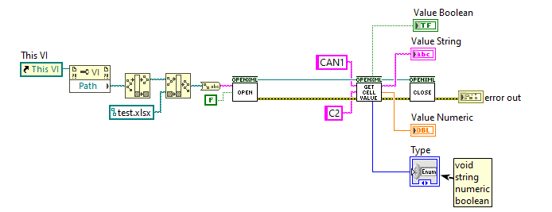
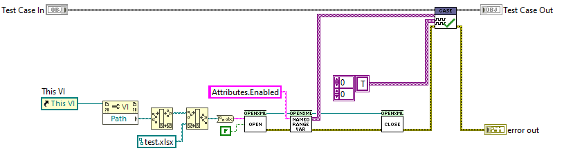

# OpenXML LabVIEW

A lightweight wrapper for reading `.xlsx` Excel files using Open XML.
This wrapper is tested against OpenXML version 3.3.0 and .NET Framework 4.6.

## Prerequisites

Before using this library, ensure you have the following dependencies:

- **LabVIEW 21**
- **LUnit Test Framework** – [GitHub Repository](https://github.com/Astemes/astemes-lunit)
- **Open XML SDK** – Download the following DLLs via NuGet or other sources:
  - `DocumentFormat.OpenXml.dll`
  - `DocumentFormat.OpenXml.Framework.dll`
  
  **Note:** It is recommended to place these DLLs next to each other within your project folder.
  
## Locating DLLs Installed via NuGet
C:\Users\<YourUserName>\.nuget\packages\documentformat.openxml.framework\3.3.0\lib\net46
C:\Users\<YourUserName>\.nuget\packages\documentformat.openxml\3.3.0\lib\net46

## Installation

1. Clone the repository along with submodules:
   ```sh
   git clone --recurse-submodules https://github.com/pettaa123/Open-Xml-LabVIEW

## Public API
This library provides functions for retrieving cell values and named ranges in an Excel worksheet:

# Get Cell Value
Returns the value of a given worksheet's cell, handling numeric, boolean and string types.



# Get Named Range of Sheet (String)
Retrieves a specified named range from a worksheet.



# Get Named Range of Sheet (VAR)
Retrieves a specified named range from a worksheet.

# Get Named Ranges of Sheet
Lists all named ranges defined within a worksheet.