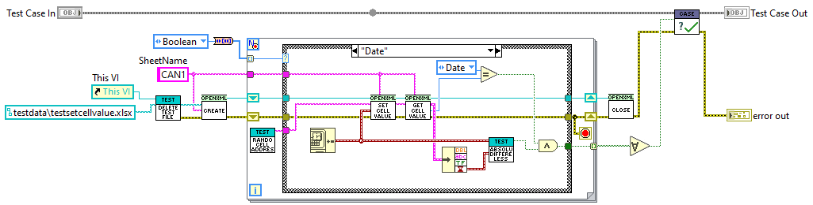
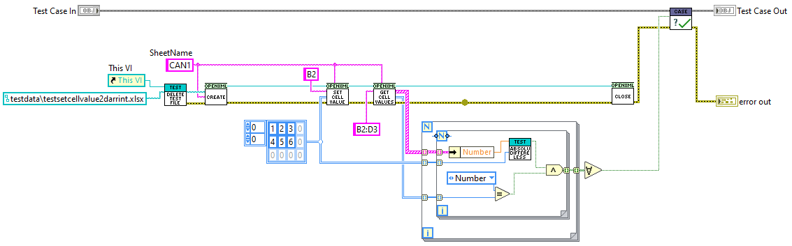
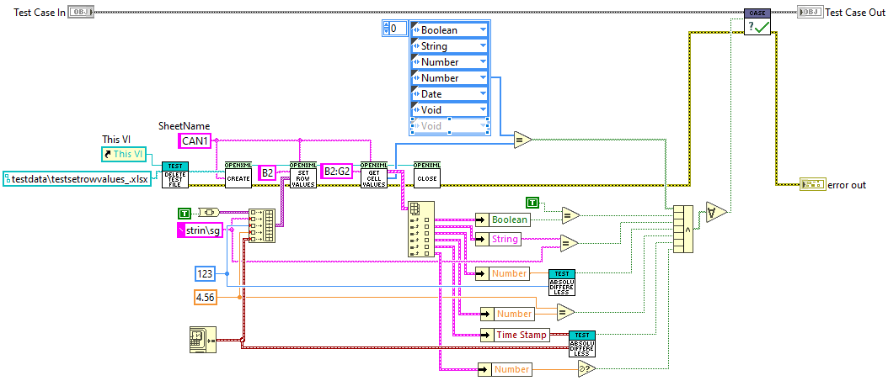
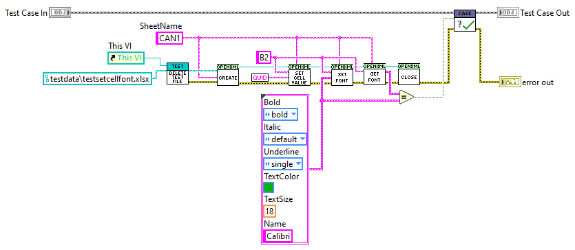
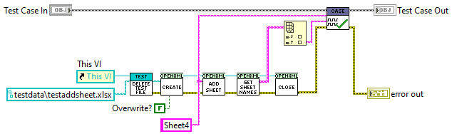
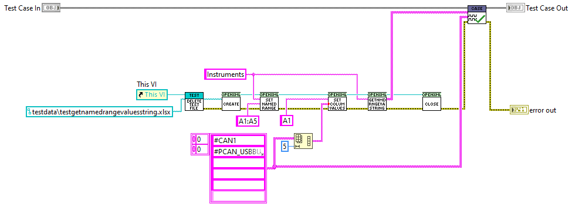
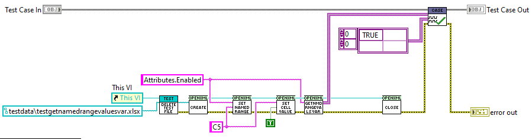

# OpenXML LabVIEW

A lightweight wrapper for creating and reading `.xlsx` Excel files using Open XML.
This wrapper is tested against OpenXML version 3.3.0 and .NET Framework 4.6.

## Prerequisites

Before using this library, ensure you have the following dependencies:

- **LabVIEW 19**
- **Open XML SDK** – Download the following DLLs via NuGet or other sources:
  - `DocumentFormat.OpenXml.dll`
  - `DocumentFormat.OpenXml.Framework.dll`
  
  **Note:** It is recommended to place these DLLs in the repo's dll folder.

- **(Optional) LUnit Test Framework (LabVIEW 20)** – [GitHub Repository](https://github.com/Astemes/astemes-lunit)
  
## Locating DLLs Installed via NuGet
C:\Users\<YourUserName>\.nuget\packages\documentformat.openxml.framework\3.3.0\lib\net46
C:\Users\<YourUserName>\.nuget\packages\documentformat.openxml\3.3.0\lib\net46

## Installation

1. Clone the repository:
   ```sh
   git clone https://github.com/pettaa123/Open-Xml-LabVIEW

## Public API
This library provides functions for setting/retrieving cell values and named ranges in an Excel worksheet:

# Set/Get Cell Value
Set and returns the value of a given worksheet's cell, handling numeric, boolean and string and datetime types and arrays.



# Set/Get Cell Value
Set and returns the value of a given worksheet's cell range.



# Set/Get Row Values
Sets and returns the values of a given worksheet's cell range, handling numeric, boolean and string and datetime types.



# Set/Get Cell Font
Set and returns the font applied to a cell.



# Add/List Workbook Sheet
Adds and lists sheets.



# Get Named Range Values (String)
Retrieves a specified named range from a worksheet.



# Get Named Range Values (VAR)
Retrieves a specified named range from a worksheet.



# Get Named Range
Lists all named ranges defined within a worksheet.